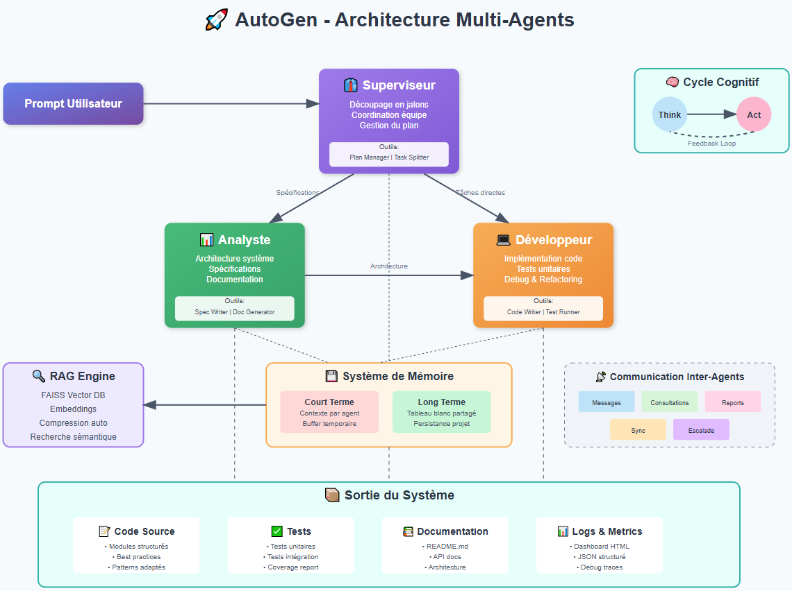

📖 [English version](README_ENG.md)

# AutoGen - Plateforme Multi-Agents IA

🚀 Plateforme multi-agents intelligente qui orchestre des agents IA spécialisés pour concevoir, développer et documenter des projets logiciels complets de manière autonome.

*Note : Ce projet n'est pas basé sur le framework AutoGen de Microsoft*
*A l'origine je voulais l'implémenter mais frustré par ses limitations, je me suis décidé a repartir from scratch*
*Le nom du projet est resté comme un clin d'oeil  a ce parcours* 😉

## ✨ Fonctionnalités principales

- **🤖 Agents spécialisés** : Une équipe composée d'un Superviseur, d'un Analyste et d'un Développeur, chacun avec un rôle, une personnalité et des outils définis dans default_config.yaml.

- **🧠 Architecture RAG** : Moteur de recherche vectorielle (rag_engine.py) basé sur FAISS pour fournir un contexte persistant et pertinent aux agents, avec gestion de mémoire de travail et compression automatique.

- **🔄 Communication inter-agents** : Échanges structurés et configurables entre les agents pour la collaboration, la résolution de problèmes et la validation.

- **📊 Monitoring avancé** : Génération de logs JSON structurés (logger.py), de traces LLM détaillées et d'un dashboard HTML (metrics_visualizer.py) pour suivre la performance du système.

- **⚡ Rate limiting intelligent** : Un gestionnaire centralisé (global_rate_limiter.py) prévient les erreurs de quotas des API externes (Mistral, DeepSeek) avec une politique de retry.

- **⚙️ Configuration Centralisée** : L'ensemble du comportement de la plateforme (modèles LLM, paramètres RAG, guidelines des agents) est piloté par le fichier config/default_config.yaml.

- **✅ Installation Automatisée** : Un script shell complet (setup.sh) gère la création de l'environnement, l'installation des dépendances et la validation du projet.


## 🏗️ Architecture




## 🚀 Installation rapide

### Prérequis
- Python 3.10+
- Conda (fortement recommandé)
- Clé API Mistral (recommandé) ou DeepSeek

### Installation automatique (recommandée)

```bash
# Cloner le projet
git clone https://github.com/yannpointud/AutoGen.git
cd AutoGen

# Installation complète en une commande
./setup.sh
```

**Options avancées :**
```bash
./setup.sh --check-only   # Vérifier l'installation existante
./setup.sh --recreate     # Recréer l'environnement from scratch
./setup.sh --help         # Afficher l'aide
```


### Installation manuelle (si nécessaire)

```bash
# Créer l'environnement avec le fichier de config
conda env create -f conda-requirements.yml
conda activate AutoGen

# (Alternative) création manuelle
conda create -n AutoGen python=3.10
conda activate AutoGen
pip install -r requirements.txt

# Configuration
cp .env.example .env
mkdir -p projects logs
```


## 🔑 Configuration

Créez un fichier `.env` avec vos clés API :

```env
MISTRAL_API_KEY=your_mistral_api_key_here # requis
DEEPSEEK_API_KEY=your_deepseek_api_key_here  # optionnel
```

*Note : le fonctionnement de la platforme est indépendant du modele utilisé*
*Il est prévu de tester d'intégrer d'autres modeles*
*Il faut a minima acces a un LLM et un modele d'embeddings*

**Obtenir les clés :**
- Mistral : [console.mistral.ai](https://console.mistral.ai/)
- DeepSeek : [platform.deepseek.com](https://platform.deepseek.com/)


## 🎮 Utilisation / Démarrage rapide

Une fois l'installation terminée :

```bash
# Activer l'environnement
conda activate AutoGen

# Lancer l'interface interactive
python main.py

# Ou vérifier que l'environnement est ok
./setup.sh --check-only
```

### Templates Réalisables

1. **MLPricePredictor** - API ML pour prédiction prix immobilier
2. **Calculator**       - Calculatrice (Python/CLI)
3. **FileOrganizer**    - Organisateur de fichiers automatique
4. **ChatBot**          - Chatbot assistant simple  
0. **Custom**           - Creez votre projet avec un prompt


## 📊 Monitoring et métriques

AutoGen génère automatiquement :

- **Logs JSON structurés** : `logs/platform_YYYYMMDD.jsonl`
- **Traces LLM détaillées** : `logs/llm_debug/`
- **Dashboard interactif** : Métriques temps réel avec visualisations
- **Rapports de progression** : État des jalons et tâches


## ⚙️ Configuration avancée

### Modèles LLM

Personnalisez les modèles dans `config/default_config.yaml` :

```yaml
llm:
  default_model: "mistral-small-latest"
  models:
    mistral:
      supervisor: "magistral-medium-latest"
      analyst: "magistral-medium-latest" 
      developer: "codestral-latest"
```

### Paramètres RAG

```yaml
rag:
  chunk_size: 1000
  chunk_overlap: 200
  top_k_results: 5
  similarity_threshold: 0.7
```

## 🧪 Tests et validation

```bash
# Vérifier l'installation
./setup.sh --check-only

# Exécuter tous les tests (après activation de l'environnement)
conda activate AutoGen
pytest tests/

# Tests avec couverture
pytest --cov=. tests/

# Tests spécifiques
python tests/test_phase5.py
```


## 🤝 Contribution

1. Fork le projet
2. Créez votre branche : `git checkout -b feature/ma-fonctionnalite`
3. Committez vos changements : `git commit -m 'Ajout ma fonctionnalité'`
4. Push vers la branche : `git push origin feature/ma-fonctionnalite`
5. Ouvrez une Pull Request


## 📝 Changelog

Consultez [CHANGELOG.md](CHANGELOG.md) pour l'historique détaillé des versions.


## 🛠️ Dépannage

### Installation et environnement

**Problème d'installation** :
```bash
# Diagnostic complet de l'environnement
./setup.sh --check-only

# Recréer l'environnement complètement
./setup.sh --recreate

# Voir l'aide complète du script
./setup.sh --help
```

**Environnement conda corrompu** :
```bash
# Nettoyer et recréer
conda env remove -n AutoGen
./setup.sh
```

**Commandes conda utiles** :
```bash
# Lister les environnements
conda env list

# Voir les packages installés
conda activate AutoGen && conda list

# Nettoyer le cache conda
conda clean --all

# Exporter la configuration actuelle
conda env export > my-environment.yml
```


### Problèmes d'exécution

**Erreur d'API timeout** :
```yaml
# Augmenter dans config/default_config.yaml
general:
  llm_timeout: 180
```

**Rate limit atteint** :
```yaml
# Ralentir les appels API
general:
  api_rate_limit_interval: 3
```


## 📚 Documentation technique

- **Script d'installation** : `./setup.sh --help`
- **Historique des versions** : [CHANGELOG.md](CHANGELOG.md)
- **API Reference** : Docstrings dans le code


## 📄 Licence

Ce projet est sous licence MIT. Voir le fichier LICENSE pour plus de détails.

## 👨‍💻 Auteur et Opportunités

Développé par Yann POINTUD / yann@pointud.fr
Passionné par l'ingénierie de systèmes IA autonomes, robustes et efficaces.
Actuellement disponible, n'hésitez pas à me contacter pour discuter de la manière dont mes compétences peuvent aider à la réussite de vos projets.


## 🔗 Liens utiles

- [Documentation Mistral AI](https://docs.mistral.ai/)
- [Python Packaging Guide](https://packaging.python.org/)

---

  ⭐ Si ce projet vous plait, n'hésitez pas à lui donner une étoile ! ⭐
